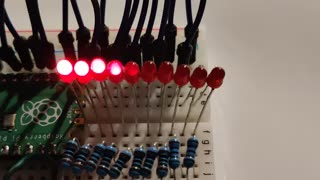
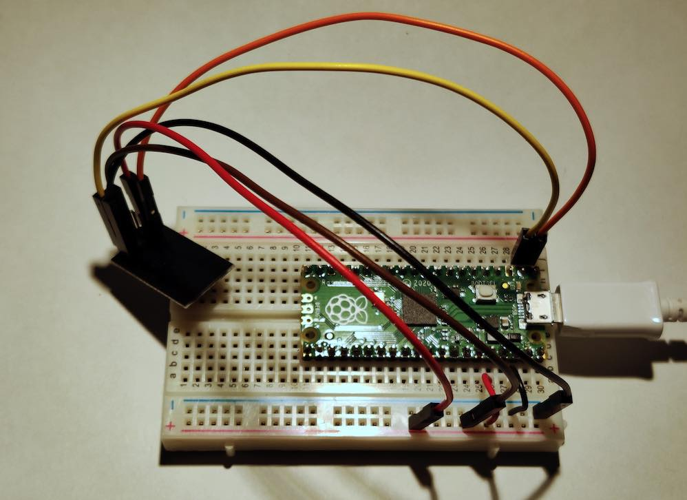

# Raspberry Pi Pico Demos

A collection of past beginner level Raspberry Pi Pico demos. Some experience with setting up electronics projects and understanding of programming concepts is assumed.

The demos:
1. [Led Array Sweeper](#led-array-sweeper) – Create dynamic visual effects using an array of LEDs
1. [WiFi Ping-Over-HTTP](#wifi-ping-over-http) – Send HTTP requests over the Internet by using a transceiver module
1. [Analog Radial Gauge](#analog-radial-gauge) – Indicate a reading by turning a needle attached to a stepper motor

## Project Information

The demos are written in [MicroPython](https://docs.micropython.org/en/latest/index.html) 1.17. For downloads and information, see:
* MicroPython firmware: https://micropython.org/download/rp2-pico/
* Getting Started With The Pico: https://projects.raspberrypi.org/en/projects/getting-started-with-the-pico
* Simple projects: https://github.com/raspberrypi/pico-micropython-examples
* More useful links: https://forums.raspberrypi.com/viewtopic.php?f=143&t=301620&sid=e144cf8bc3501246e2e98f14c1a3a4dd

If you're new to the Pico, or building electronic projects, it may be a good idea to check out a few simpler guides provided by the Raspberry Pi Foundation (see links above) or any other source you like.

### Building The Demos

You can pick and choose your own development tools as you please, but here's a few recommendations anyway:
* **Visual Studio Code** (all platforms supported): https://code.visualstudio.com
* VS Code extension **Pico-Go**: https://marketplace.visualstudio.com/items?itemName=ChrisWood.pico-go
* **Thonny** (Python IDE for beginners): https://thonny.org/

The following items are common for all of the demos:
* One Raspberry Pi Pico
* A cable for communicating with Pico (typically Micro-USB)
* A breadboard

### Running The Demos

Select a demo you want to try out. Then:
1. Build the project using the suggested components, or whatever you have at hand
1. Examine the scripts (`demo.py` in particular) and evaluate whether they require altering in order to run properly
1. Upload **all files** from inside the demo directory **to the root directory** of the Pico
1. Run `demo.py`, which is the main file for each demo

---

## Demos

### Led Array Sweeper

The demo uses 10 leds to cycle through four different sequences in order.

**Video clip**

[See full size photo](led-array-sweeper-breadboard-photo.jpg)

Component | Used in the demo
-- | --
Resistors  | 10 × 1k Ω
LEDs  | 10 × 3 mm, red
Wires  | 11 × male/male

Smaller 3 mm LEDs were used so that all 10 of them could fit into the 0.1" spacing as pictured. Physically larger LEDs probably need some other configuration.

In principle, the number of LEDs in this project is limited by the number of available GPIOs. The program logic should work with any reasonable number of LEDs but if you use just a few of them you may have to fine-tune the variables to produce satisfactory results.

The setup for each LED:
* LED anode (long leg) connects to a GPIO
* LED cathode (short leg) connects to a resistor
* The resistor connects to grounded bus strip

In the example, the GPIOs are 16, 17, 18, 19, 20, 21, 22, 26, 27, and 28.

Pin 18 (GND) grounds the bus strip.

#### Ideas

* Arrange LEDs into a circle and use `linear` sequence for a swirly rotating effect
* Set up white LEDs into a scattered pattern and use a slow random sequence for a twinkly stars effect
* Embed the LED array running `sweeper` into the hood of a Pontiac Trans Am, see: https://en.wikipedia.org/wiki/KITT

---

### WiFi Ping-Over-HTTP

The demo executes a simple HTTP GET request to a server over the Internet, then prints out details of the response.

[See full size photo](wifi-ping-over-http-breadboard-photo.jpg)

Component | Used in the demo
-- | --
ESP8266 Transceiver Module | 1
Wires  | 5 × male/female, 2 × male/male

Wiring configuration:
Transceiver | Pico
-- | -
UTXD | UART0 TX (Pin 1)
URXD | UART0 RX (Pin 2)
Power | 3V3 (OUT) (Pin 36)
Ground | GND (Pin 38)

The demo uses Serial WiFi Transceiver Module ESP8266.

Product wiki page: https://www.elecrow.com/wiki/index.php?title=Serial_WIFI_Transceiver_Module_ESP8266

#### Program Code

You need to fill in your wireless network name and password in `main.py` before the script can execute. It takes a few seconds to finish but its progress and the result can be observed in the console.

By default the script uses [httpbin.org](https://httpbin.org/)'s service to get a response over the Internet but any other valid resource works just as well.

For some reason this setup seems somewhat unstable, which means subsequent runs don't reliably execute with the same result every time. So, if there is a problem getting a response you can just try again a few more times. You could also try adding some delay to the command calls.

#### Ideas

It should be easy to use the class already as it is for real projects. However, there are several other functions available on the transceiver module that can be easily added to the implementation.

---

### Analog Radial Gauge

The demo turns the needle to briefly point at marked values one at a time, then retuns back and starts over.

**Video clip**

[See full size photo](analog-radial-gauge-breadboard-photo.jpg)

The demo uses 28BYJ-48 5V stepper motor with a ULN2003 driver board, it should be easy to find these anywhere. For more information about the components turn to your preferred search engine.

Component | Used in the demo
-- | --
28BYJ-48 Step Motor | 1
ULN2003 driver board | 1
Wires | 6 × male/female

Wiring configuration:
Driver board | Pico
-- | -
IN1 | GP16
IN2 | GP17
IN3 | GP18
IN4 | GP19
5–12V + | VBUS (Pin 40)
5–12V - | GND (Pin 38)

The makeshift gauge with needle (in the picture) was built with some paper, Blue Tac and a piece of wire.

In the demo the zero is wherever the needle points at in the beginning of execution, so you may have to reset the needle manually after each run.

#### Ideas

* In various sensor data projects, replace your boring old LCD displays with crude but stylish "analog" contraptions
* Evolve the demo into a sauna thermometer. For this, you may want to look into 1-wire digital thermometers such as DS18B20

# License

MIT License
