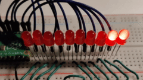

# Raspberry Pi Pico Demos

A collection of past beginner level Raspberry Pi Pico demos. Some experience with setting up electronics projects and understanding of programming concepts is assumed.

The demos:
1. [LED Array Sweeper](#led-array-sweeper) – Create dynamic visual effects using an array of LEDs\
    

1. [WiFi Ping-Over-HTTP](#wifi-ping-over-http) – Send HTTP requests over the Internet by using a transceiver module

1. [Analog Radial Gauge](#analog-radial-gauge) – Indicate a reading by turning a needle attached to a stepper motor\
    

1. [Digital Rotary Counter](#digital-rotary-counter) – Cycle through numbers on a digital rotary counter\
    

1. [RGB LED Flame](#rgb-led-flame) – Fire up an RGB LED with a cozy flickering flame effect\
    

### How To Run

First, pick a demo. Then:
1. Build the project using the suggested components, or whatever parts you have at hand
1. Examine the scripts (`demo.py` in particular) and evaluate whether they require altering in order to run properly
1. Upload **all necessary files** from inside the demo directory **to the root directory** of the Pico
1. Run `demo.py`, which is the main file for each demo

## About The Demos

The demos are written in [MicroPython](https://docs.micropython.org/en/latest/index.html) 1.17. For downloads and information, see:
* MicroPython firmware: https://micropython.org/download/rp2-pico/
* Getting Started With The Pico: https://projects.raspberrypi.org/en/projects/getting-started-with-the-pico
* Simple projects: https://github.com/raspberrypi/pico-micropython-examples
* More useful links: https://forums.raspberrypi.com/viewtopic.php?f=143&t=301620&sid=e144cf8bc3501246e2e98f14c1a3a4dd

If you're new to the Pico, or building electronic projects, it may be a good idea to check out a few simpler guides provided by the Raspberry Pi Foundation (see links above) or any other source you like.

### Building The Demos

You can pick and choose your own development tools as you please, but here's a few recommendations anyway:
* **Visual Studio Code** (all platforms supported): https://code.visualstudio.com
* VS Code extension **Pico-Go**: https://marketplace.visualstudio.com/items?itemName=ChrisWood.pico-go
* **Thonny** (Python IDE for beginners): https://thonny.org/

The following items are common for all of the demos:
* One Raspberry Pi Pico
* A cable for communicating with Pico (typically Micro-USB)
* A breadboard

---

## Demos

### LED Array Sweeper

The demo uses 10 LEDs to cycle through four different sequences in order.

[ Click for full size](led-array-sweeper.png)

Component | Used in the demo
-- | --
LEDs  | 10 (regular 5 mm, red)
Wires  | 22 × male/male

The setup in principle:
* LED anode (long leg) connects to a GPIO
* LED cathode (short leg) connects to GND

Basically, the number of LEDs in this project is limited by the number of available GPIOs. The program logic should work with any reasonable number of LEDs but if you use just a few of them you may have to fine-tune the variables to produce satisfactory results.

In the example, the GPIOs are 16, 17, 18, 19, 20, 21, 22, 26, 27, and 28.

Pin 18 (GND) grounds the bus strip.

#### Ideas

* Arrange LEDs into a circle and use `linear` sequence for a swirly rotating effect
* Set up white LEDs into a scattered pattern and use a slow random sequence for a twinkly stars effect
* Embed the LED array running `sweeper` into the hood of a Pontiac Trans Am, see: https://en.wikipedia.org/wiki/KITT

---

### WiFi Ping-Over-HTTP

The demo executes a simple HTTP GET request to a server over the Internet, then prints out details of the response.

[ Click for full size](wifi-ping-over-http.png)

Component | Used in the demo
-- | --
Serial WiFi Transceiver Module ESP8266-01 | 1
Wires  | 5 × male/female

Wiring configuration:
Transceiver | Pico
-- | -
UTXD | UART0 TX (Pin 1)
URXD | UART0 RX (Pin 2)
Vcc | 3V3 (OUT) (Pin 36)
CH_PD | 3V3 (OUT) (Pin 36)
GND | GND (Pin 38)

For more information, see the manufacturer's wiki page: https://www.elecrow.com/wiki/index.php?title=Serial_WIFI_Transceiver_Module_ESP8266

#### Program Code

You need to fill in your wireless network name and password in `main.py` before the script can execute. It takes a few seconds to finish but its progress and the result can be observed in the console.

By default the script uses [httpbin.org](https://httpbin.org/)'s service to get a response over the Internet but any other valid resource works just as well.

For some reason this setup seems somewhat unstable, which means subsequent runs don't reliably execute with the same result every time. So, if there is a problem getting a response you can just try again a few more times. You could also try adding some delay to the command calls.

#### Ideas

It should be easy to use the class already as it is for real projects. However, there are several other functions available on the transceiver module that can be easily added to the implementation.

---

### Analog Radial Gauge

The demo turns the needle to briefly point at marked values one at a time, then retuns back and starts over.

[See full size photo](analog-radial-gauge-breadboard-photo.jpg)

The demo uses 28BYJ-48 5V stepper motor with a ULN2003 driver board, it should be easy to find these anywhere. For more information about the components turn to your preferred search engine.

Component | Used in the demo
-- | --
28BYJ-48 Step Motor | 1
ULN2003 driver board | 1
Wires | 6 × male/female

Wiring configuration:
Driver board | Pico
-- | -
IN1 | GP16
IN2 | GP17
IN3 | GP18
IN4 | GP19
5–12V + | VBUS (Pin 40)
5–12V - | GND (Pin 38)

The makeshift gauge with needle (in the picture) was built with some paper, Blue Tac and a piece of wire.

In the demo the zero is wherever the needle points at in the beginning of execution, so you may have to reset the needle manually after each run.

#### Ideas

* In various sensor data projects, replace your boring old LCD displays with crude but stylish "analog" contraptions
* Evolve the demo into a sauna thermometer. For this, you may want to look into 1-wire digital thermometers such as DS18B20

---

### Digital Rotary Counter

The demo rotates through a programmed sequence of numbers. This demo uses an SBC-OLED01 display, but it should also work with other devices compatible with [the SSD1306 driver](digital-rotary-counter/ssd1306.py) (copied from the MicroPython project).

 

Component | Used in the demo
-- | --
SBC-OLED01 display | 1
Wires | 4 × male/male

Wiring configuration:
Display | Pico
-- | -
SCL | GP16
SDA | GP17
Vcc | 3V3 (OUT) (Pin 36)
GND | GND (Pin 38)

#### The Numbers

The numbers seen on the display were built from [Binary (raw) 1-bit PBM](https://en.wikipedia.org/wiki/Netpbm) picture data, which was compiled into a source file, see [numbers.py](digital-rotary-counter/numbers.py).

If you want to create your own numbers, you can use a free image editor [GIMP](https://www.gimp.org/), for example, to work on the files. You need to create a file for each number (10 in total), then use the script (see below) to compile the data.

In GIMP, when you have prepared your single number image, downgrade the palette by using **Image** → **Mode** → **Indexed…**, and select the 1-bit option. It may take a few attempts but when you're happy with the result, select **Export…**, use the suffix `.pbm`, and hit **Export**. When prompted, select Data formatting: **Raw** (not ASCII).

For reference, the demo directory contains:
* A helper script [create_bytearrays_from_glyphs.py](digital-rotary-counter/create_bytearrays_from_glyphs.py) for compiling
* The `numbers/0..9.pbm` files used in the demo
* The GIMP image [numbers/numbers_w20_h30.xcf](digital-rotary-counter/numbers/numbers_w20_h30.xcf) which is the source of the number files

#### Ideas

* By adding buttons **RESET** and **+1**, you could actually make real use of this project in some situations
* Adjust the speeds and rotation sequence to build a nailbiter lottery machine (again, do use buttons liberally)
* You can actually fit a sixth digit in there by changing the parameters in `demo.py`, and if that's not enough just build a smaller set of numbers (see instructions above)

---

### RGB LED Flame

[See full size photo](rgb-led-flame-breadboard-photo.jpg)

**Don't have an RGB LED?** Just use a regular LED in GP18 to experience the flickering effect.

Component | Used in the demo
-- | --
Common Cathode RGB LED | 1
Resistors  | 3 × 330 Ω
Wires | 4 × male/male

Wiring configuration:
LED | Pico
-- | -
Red | GP18 (with resistor)
Ground (longest leg) | GND (Pin 18)
Green | GP17 (with resistor)
Blue | GP16 (with resistor)

In this demo, the RGB LED is covered with a small piece of plastic foam to diffuse the colors. You can achieve similar (or even much better) results by using some other materials and methods.

When run, the script creates a lengthy sequence of random values that's used to change the light intensity over time, which creates the flickering effect. The sequence is different every time the script is run, and repeats indefinitely.

#### Ideas

* Should be straightforward to use as a safe replacement for an actual candle
* Add a button to ignite and smother the flame with a smooth effect
* Add a potentiometer "gas valve" to adjust the brightness

# License

MIT License
